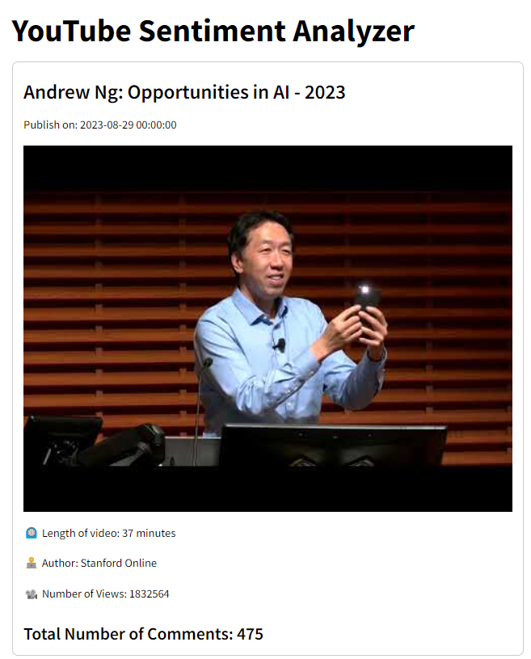

## YouTube Sentiment Analyzer

The YouTube Sentiment Analyzer is a web application designed to provide detailed sentiment analysis of YouTube video comments. By leveraging the YouTube Data API and the TextBlob library, this tool allows users to:
- Extract Comments: Gather comments from any YouTube video by simply entering the video URL.
- Analyze Sentiment: Categorize comments into positive, negative, or neutral sentiments based on computed polarity scores.
- Visualize Data: Generate insightful visualizations including wordcloud, sentiment distributions, and polarity histograms.

### Application Output

Metadata of the YouTube video, including the title, published date, number of views and, number of comments.

Polarity histogram.

Positive, neutral, and negative sentiments.

Subjectivity histogram.

Keywords in the comments visualize via wordcloud.

